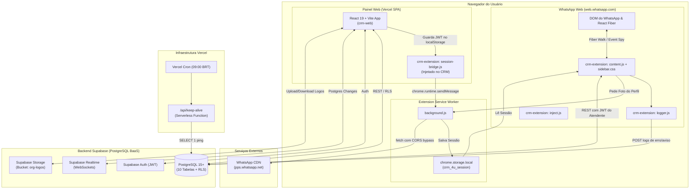
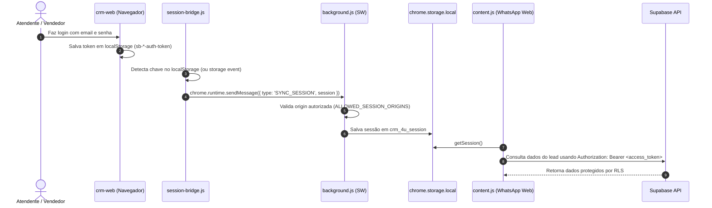

# 🏗️ Arquitetura do Sistema — CRM 4U Connect

Este documento detalha a arquitetura técnica global do ecossistema **CRM 4U Connect**, os componentes envolvidos, padrões de comunicação e fluxos de dados.

---

## 1. Visão Geral da Arquitetura

O sistema é composto por três componentes principais que operam de maneira desacoplada e sincronizada através do **Supabase**:



---

## 2. Componentes do Sistema

### 2.1. `crm-extension` (Extensão Google Chrome — Manifest V3)
Injeta a interface do CRM na lateral direita do WhatsApp Web.
- **`manifest.json`**: Declara permissões (`storage`), origens autorizadas (`host_permissions`) e scripts.
- **`content.js`**: Cria a sidebar na página do WhatsApp Web, renderiza o formulário do lead, lista de notas, atividades e botões de ação.
- **`session-bridge.js`**: Injetado automaticamente na página do CRM Web (`crm-web`), captura o JWT do Supabase salvo no `localStorage` e transmite para a extensão via `chrome.runtime.sendMessage`.
- **`background.js`**: Service Worker da extensão. Recebe as mensagens da ponte de sessão, armazena o token em `chrome.storage.local` e busca fotos do perfil no CDN do WhatsApp (`pps.whatsapp.net`), convertendo-as em **Data URI Base64** para contornar restrições de CORS e expiração de links.
- **`logger.js`**: Intercepta logs e erros de execução na extensão e envia para a tabela `extension_logs` no Supabase (quando o modo debug está ativo ou quando ocorrem exceções).
- **`sidebar.css`**: Estilos visuais isolados da barra lateral do CRM.
- **`WHATSAPP_DOM_REFERENCE.md`**: Mapeamento dos seletores DOM e nós do React Fiber do WhatsApp Web.

### 2.2. `crm-web` (Aplicação Web React + Vite)
Painel administrativo e operacional completo.
- **Tecnologias**: React 19, TypeScript, Vite, Tailwind CSS, Lucide Icons, React Router v7.
- **Gerenciamento de Estado**: Contextos React (`AuthContext`, `BrandingContext`, `StatusesContext`, `FollowUpsContext`).
- **Páginas**:
  - `/login`: Autenticação via email/senha (Supabase Auth).
  - `/dashboard`: Gráficos de conversão, motivos de perda, tempo médio e pipeline de vendas.
  - `/leads`: Visualização em **Kanban Board** ou **Tabela**, com drawer lateral completo de detalhes do lead.
  - `/arquivados`: Gestão de leads arquivados com restauração ou exclusão.
  - `/followups`: Calendário e lista de tarefas/atividades agendadas.
  - `/configuracoes`: Gestão de status do funil, canais de origem, segmentos, branding e usuários.
  - `/status`: Status da aplicação e conectividade.
- **Funções Serverless (Vercel)**:
  - `/api/keep-alive.js`: Acionada diariamente pelo Vercel Cron para manter o projeto Supabase (tier gratuito) aquecido e prevenir pausas automáticas.
  - `/api/status.js`: Endpoint de verificação de integridade da API.

### 2.3. Supabase (BaaS — Backend as a Service)
- **PostgreSQL**: Banco de dados relacional com multi-tenancy rigoroso isolado por `organization_id`.
- **Row Level Security (RLS)**: Cada consulta e mutação é filtrada automaticamente pelo usuário autenticado (`auth.uid()`) e sua respectiva organização.
- **Supabase Realtime**: Publicação via WebSocket nas tabelas `leads`, `lead_statuses` e `lead_activities` para refletir atualizações instantaneamente entre abas e usuários.
- **Supabase Storage**: Bucket `org-logos` com políticas RLS para armazenamento seguro das marcas das organizações.

---

## 3. Fluxos de Dados Críticos

### 3.1. Autenticação & Ponte de Sessão (Zero-Login na Extensão)
Para evitar que o vendedor precise digitar login e senha duas vezes (no CRM e na extensão), o sistema utiliza o mecanismo de **Session Bridge**:



### 3.2. Inspeção DOM & React Fiber Walk no WhatsApp Web
Para identificar o contato selecionado no WhatsApp Web:
1. `content.js` escuta cliques e mutações no DOM do WhatsApp Web.
2. Quando uma conversa é aberta, inspeciona o nó do cabeçalho ou o item da lista (`[data-testid^="list-item-"]`).
3. Para contatos **não salvos**, o número de telefone é extraído diretamente do texto no DOM (`span[dir="auto"]`).
4. Para contatos **salvos** (onde o DOM exibe apenas o nome), a extensão executa um *Fiber Walk* na instância interna do React do WhatsApp Web (chave `__reactFiber$...`), acessando o objeto `props.chat.id.user` para obter o número real.
5. Com o número formatado, a extensão consulta a tabela `leads` no Supabase.

### 3.3. Captura de Foto de Perfil (Base64 Pipeline)
1. O CDN de imagens do WhatsApp (`pps.whatsapp.net`) gera URLs temporárias com tokens de expiração curta.
2. Adicionalmente, o `content.js` é impedido de fazer `fetch` direto na imagem devido às restrições de CORS do WhatsApp.
3. **Solução**: O `content.js` solicita a URL ao `background.js` via mensagem `FETCH_PHOTO`. O Service Worker baixa a imagem sem bloqueio de CORS, converte os bytes em **Data URI Base64** (`data:image/jpeg;base64,...`) e retorna ao `content.js`, que persiste a foto diretamente no banco Supabase.

---

## 4. Segurança e Isolamento Multi-tenant

1. **Anon Key Pública vs Service Role Privada**:
   - O frontend e a extensão utilizam estritamente a `VITE_SUPABASE_ANON_KEY`.
   - Nenhuma chave privilegiada (`service_role`) trafega no cliente.
2. **Políticas de RLS no PostgreSQL**:
   - Todo comando `SELECT`, `INSERT`, `UPDATE` e `DELETE` valida:
     ```sql
     organization_id = (SELECT organization_id FROM public.profiles WHERE id = auth.uid())
     ```
3. **Isolamento de Origens na Extensão**:
   - O `background.js` valida se a mensagem `SYNC_SESSION` provém de uma origem confiável cadastrada na lista `ALLOWED_SESSION_ORIGINS` (ex: `http://localhost:5173` ou `https://connect-crm.vercel.app`), rejeitando requisições de outros domínios.
