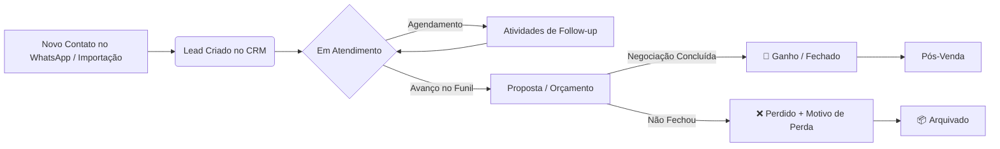

# 🎯 Contexto e Regras de Negócio — CRM 4U Connect

O **CRM 4U Connect** (também identificado na extensão como **Connect CRM**) é uma solução integrada de CRM (Customer Relationship Management) projetada especificamente para operações comerciais e de atendimento que utilizam o **WhatsApp Web** como canal primário de vendas.

---

## 1. Problema e Proposta de Valor

### O Problema
Equipes de atendimento e vendas que atendem clientes pelo WhatsApp enfrentam diversos desafios operacionais:
- **Alternância constante de janelas**: Ter que sair da conversa no WhatsApp para atualizar o CRM tradicional causa perda de foco, atrasos e negligência no registro de dados.
- **Perda de histórico e contexto**: Dificuldade de saber rapidamente em qual estágio da negociação o cliente está, o que foi conversado anteriormente e quando deve ser o próximo follow-up.
- **Falta de padronização no funil**: Vendedores esquecem de registrar orçamentos enviados, motivos de perda ou agendar novas tentativas de contato.

### A Proposta de Valor
O CRM 4U Connect resolve esses problemas unindo duas frentes:
1. **Painel Lateral Embutido no WhatsApp Web (`crm-extension`)**: O atendente visualiza e edita os dados do lead, status no funil, histórico de anotações e atividades agendadas diretamente dentro da tela do WhatsApp Web, com sincronização automática ao selecionar qualquer conversa.
2. **Painel de Gestão Completo (`crm-web`)**: Uma aplicação web moderna e em tempo real com Kanban, tabela de leads, filtros avançados, importação/exportação, agenda de follow-ups e dashboard de métricas para gestores.

---

## 2. Perfis de Usuário (Personas)

O sistema implementa controle de acesso baseado em funções (*Role-Based Access Control*):

| Perfil | Descrição | Permissões Principais |
|---|---|---|
| **Admin (Gestor)** | Administrador da organização | - Acesso total ao Dashboard gerencial e métricas de vendas. - Gerenciamento de usuários, etapas do funil, origens e segmentos. - Personalização visual da empresa (logo, nome de exibição). - Acesso à aba de **Diagnóstico** com logs técnicos da extensão. - Gestão de todos os leads da organização. |
| **Atendente (Vendedor)** | Operador de atendimento e vendas | - Gestão dos seus próprios leads e leads atribuídos. - Movimentação de leads no Pipeline e registro de notas. - Criação e conclusão de atividades/follow-ups. - Operação no WhatsApp Web através da extensão. |

---

## 3. Entidades e Conceitos de Negócio

### 3.1. Organização (Multi-tenancy)
Cada cliente/empresa opera em sua própria `Organization`.
- Todo dado (leads, status, atividades, notas, usuários) é estritamente isolado pelo `organization_id` no banco de dados via RLS (*Row Level Security*).
- Personalização de branding: Logo da empresa e Nome de exibição customizados.
- O cadastro inicial exige um WhatsApp principal da empresa. Ele é armazenado como contato administrativo da organização para comunicação sobre a conta, sem se misturar aos leads do cliente.
- O cadastro autônomo solicita somente nome, empresa, e-mail, senha e WhatsApp. Departamento não é solicitado ao cliente: o perfil recebe o padrão interno `comercial`, preservando a compatibilidade com o CRM.
- O cadastro novo inicia inativo. O Super Admin libera exclusivamente a conta inicial da empresa em **Clientes & Assinaturas** depois de conferir o contato e o plano; essa tela não gerencia colaboradores.
- O titular pode atualizar o nome da própria empresa e consultar plano, vigência e consumo de leads; não pode alterar valores, limites ou status da assinatura.

### 3.2. Lead
O lead é o coração do CRM. Cada lead possui:
- **Identificação**: Nome, WhatsApp (chave de correlação com a conversa), Foto de perfil (armazenada em Base64).
- **Classificação**: Origem (`lead_sources`), Segmento (`lead_segments`) e Tags livres.
- **Negociação**: Status atual do funil (`lead_statuses`), Valor monetário estimado (`valor`), Responsável (`profiles`).
- **Planejamento**: Data/hora do próximo follow-up (`proximo_followup`).
- **Encerramento**: Flag de arquivamento (`arquivado`), data de arquivamento (`arquivado_em`) e motivo de perda (`motivo_perda`).

### 3.3. Pipeline & Statuses (Etapas do Funil)
Os status do funil são 100% configuráveis por organização:
- Cada status possui: rótulo (`label`), chave identificadora (`value`), cores visuais (texto, fundo, badge) e ordenação (`ordem`).
- **Automação de Tarefas**: Um status pode ser configurado com *Auto-Task* (ao mover um lead para a coluna X, uma atividade padrão, ex: "Cobrar resposta em 2 dias", é gerada automaticamente).

### 3.4. Atividades & Follow-ups
Tarefas com data e hora agendadas vinculadas ao lead para garantir que nenhuma oportunidade esfrie:
- **Tipos de Atividade**:
  - 📞 `ligar` — Ligar para o cliente
  - 💬 `enviar_mensagem` — Enviar mensagem no WhatsApp
  - 📋 `retornar_orcamento` — Retornar orçamento / cotação
  - ⏰ `cobrar_resposta` — Cobrar resposta de proposta
  - 🤝 `reuniao` — Reunião / Demonstração
  - 📄 `enviar_proposta` — Enviar proposta comercial
  - 🎁 `pos_venda` — Acompanhamento pós-venda
- **Status da Atividade**: `pendente`, `concluida` ou `atrasada`.

### 3.5. Motivos de Perda (`motivo_perda`)
Quando uma negociação não é convertida, o sistema permite categorizar a perda para análise de gargalos no Dashboard:
- `preco` (Preço alto / fora do orçamento)
- `concorrencia` (Fechou com concorrente)
- `sem_resposta` (Cliente sumiu / não respondeu)
- `sem_orcamento` (Sem orçamento no momento)
- `timing` (Momento inadequado / projeto adiado)
- `nao_qualificado` (Fora do perfil de cliente ideal)
- `outro` (Outros motivos)

---

## 4. Ciclo de Vida do Lead

1. **Descoberta & Captura**: O atendente abre a conversa no WhatsApp Web. A extensão detecta o contato. Se ainda não existir no CRM, o atendente pode salvá-lo com 1 clique (preenchendo nome, status inicial e tags).
2. **Nutrição & Follow-up**: O atendente cria atividades agendadas ou anotações rápidas. Se o lead for movido de etapa no Kanban do CRM Web, o status reflete imediatamente na extensão (e vice-versa via Realtime).
3. **Fechamento**:
   - **Ganho**: Avançado até a etapa final de sucesso.
   - **Perda**: Marcado como perdido com seleção do motivo.
4. **Arquivamento**: Leads inativos ou concluídos podem ser arquivados manualmente, mantendo a visão do Kanban limpa e acessível na aba de *Arquivados*.
