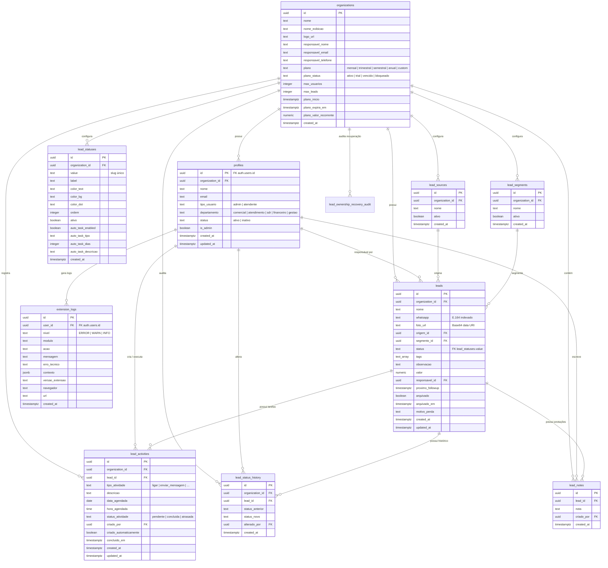

# 🗄️ Estrutura do Banco de Dados — CRM 4U Connect

Este documento descreve o modelo relacional de dados, diagramas de entidade-relacionamento (ERD), regras de segurança em nível de linha (RLS) e o catálogo de migrations do projeto **CRM 4U Connect** no **Supabase / PostgreSQL**.

---

## 1. Diagrama Entidade-Relacionamento (ERD)



---

## 2. Dicionário de Tabelas

### 2.1. `organizations`
Armazena as empresas clientes (tenants).
- `id` (UUID, PK): Identificador único da empresa.
- `nome` (TEXT): Razão social ou nome institucional.
- `nome_exibicao` (TEXT): Nome comercial exibido no topo do CRM e extensão.
- `logo_url` (TEXT): URL pública da imagem da logo (salva no bucket `org-logos`).
- `responsavel_nome`, `responsavel_email`, `responsavel_telefone` (TEXT): Contato administrativo principal da empresa; o WhatsApp é obrigatório em novos cadastros autônomos.
- `created_at` (TIMESTAMPTZ): Data de cadastro.

### 2.2. `profiles`
Espelho público dos usuários autenticados (`auth.users`).
- `id` (UUID, PK, FK `auth.users.id` ON DELETE CASCADE).
- `organization_id` (UUID, FK `organizations.id`): Tenant ao qual o usuário pertence.
- `nome` (TEXT): Nome completo do operador/gestor.
- `email` (TEXT): E-mail de login.
- `tipo_usuario` (TEXT): `'admin'` ou `'atendente'`.
- `departamento` (TEXT): Setor de atuação do colaborador (`'comercial'`, `'atendimento'`, `'sdr'`, `'financeiro'`, `'gestao'`).
- `status` (TEXT): `'ativo'` ou `'inativo'`.
- `is_admin` (BOOLEAN): Flag rápida para liberação de permissões administrativas no frontend.

### 2.3. `lead_statuses`
Etapas e colunas do Pipeline / Funil de Vendas.
- `id` (UUID, PK).
- `organization_id` (UUID, FK).
- `value` (TEXT): Identificador textual imutável do status (ex: `'novo'`, `'orcamento_enviado'`, `'ganho'`, `'perdido'`).
- `label` (TEXT): Texto legível exibido no cabeçalho da coluna.
- `color_text`, `color_bg`, `color_dot` (TEXT): Hexadecimal ou classes CSS para visualização.
- `ordem` (INTEGER): Posição da esquerda para a direita no Pipeline.
- `ativo` (BOOLEAN): Se o status está em uso.
- `auto_task_enabled`, `auto_task_tipo`, `auto_task_dias`, `auto_task_descricao`: Regras para criação automática de tarefas de follow-up ao mover um lead para este status.

### 2.4. `leads`
Tabela central de contatos e oportunidades comerciais.
- `id` (UUID, PK).
- `organization_id` (UUID, FK).
- `nome` (TEXT): Nome do cliente ou razão social.
- `whatsapp` (TEXT): Número de telefone formatado (ex: `+5511999998888`).
- `foto_url` (TEXT): Avatar do WhatsApp em Base64 Data URI ou URL pública.
- `origem_id` (UUID, FK `lead_sources.id`): Canal de aquisição (Google, Instagram, Indicação, etc.).
- `segmento_id` (UUID, FK `lead_segments.id`): Ramo de atuação / nicho.
- `status` (TEXT): Status atual do lead correspondente a `lead_statuses.value`.
- `tags` (TEXT[]): Lista de tags livres para filtros rápidos.
- `observacao` (TEXT): Resumo ou anotações gerais.
- `valor` (NUMERIC): Valor monetário estimado da negociação (R$).
- `responsavel_id` (UUID, FK `profiles.id`): Vendedor encarregado.
- `proximo_followup` (TIMESTAMPTZ): Data e horário do próximo contato agendado.
- `arquivado` (BOOLEAN): `true` quando o lead foi movido para o arquivo.
- `arquivado_em` (TIMESTAMPTZ): Momento do arquivamento.
- `motivo_perda` (TEXT): Motivo selecionado caso o lead tenha sido marcado como perdido.

Nos `INSERT`s autenticados, a migration 32 deriva `organization_id` do perfil de `auth.uid()` antes da validação de cota. A RLS continua conferindo o mesmo tenant; o valor enviado pelo navegador não concede autoridade para escolher outra organização.

### 2.5. `lead_activities`
Compromissos, tarefas e follow-ups agendados para o lead.
- `id` (UUID, PK).
- `organization_id` (UUID, FK).
- `lead_id` (UUID, FK `leads.id` ON DELETE CASCADE).
- `tipo_atividade` (TEXT): `'ligar'`, `'enviar_mensagem'`, `'retornar_orcamento'`, `'cobrar_resposta'`, `'reuniao'`, `'enviar_proposta'`, `'pos_venda'`.
- `descricao` (TEXT): Detalhes da tarefa.
- `data_agendada` (DATE) e `hora_agendada` (TIME): Momento do agendamento.
- `status_atividade` (TEXT): `'pendente'`, `'concluida'` ou `'atrasada'`.
- `criado_por` (UUID, FK `profiles.id`).
- `criado_automaticamente` (BOOLEAN): `true` se foi criada pela automação de coluna.
- `concluido_em` (TIMESTAMPTZ).

Novas atividades herdam `organization_id` do lead pai por trigger (migration 32), mantendo a relação no mesmo tenant mesmo em clientes legados que omitem o campo.

### 2.6. `lead_status_history` & `lead_notes`
- `lead_status_history`: Registro imutável de cada movimentação de status do lead (quem moveu, de qual status para qual, data/hora). É gerado pelos triggers de `leads`; a migration 33 absorve como `no-op` apenas o POST idêntico feito por extensões antigas depois que o evento automático já existe.
- `lead_notes`: Linha do tempo de comentários e anotações adicionadas pelos atendentes; novos registros herdam o `organization_id` do lead pai por trigger.

### 2.7. `lead_ownership_recovery_audit`
Trilha de auditoria da recuperação de vínculos de leads. Registra o vínculo anterior, o destino e um snapshot dos campos de classificação antes da transferência. Possui RLS por `organization_id` e não é alterada pelo CRM.

### 2.7. `extension_logs`
Telemetria remota e diagnóstico da extensão Chrome.
- `user_id` (UUID, FK `auth.users.id`).
- `nivel` (TEXT): `'ERROR'`, `'WARN'`, `'INFO'`.
- `modulo`, `acao`, `mensagem`, `erro_tecnico`, `contexto` (JSONB), `versao_extensao`, `navegador`, `url`.

---

## 3. Segurança e Row Level Security (RLS)

Todas as tabelas do schema `public` possuem RLS ativado:

```sql
ALTER TABLE public.<tabela> ENABLE ROW LEVEL SECURITY;
```

As políticas garantem que um usuário autenticado só possa visualizar, inserir ou modificar registros onde:
```sql
organization_id = (SELECT organization_id FROM public.profiles WHERE id = auth.uid())
```

---

## 4. Guia de Migrations (`database/migrations/`)

O diretório `database/migrations/` contém apenas a evolução reutilizável do banco. Em produção existente, aplique somente arquivos ainda pendentes; em banco vazio, siga a ordem abaixo e não execute o seed 02. Os números 17, 20 e 31 foram reservados porque os scripts originais eram operações pontuais e foram movidos para `database/operations/archive/`.

| # | Arquivo | Descrição |
|---|---|---|
| 01 | `01_schema.sql` | Schema estrutural completo, tabelas, RLS inicial e triggers. |
| 02 | `02_data_seed.sql` | **Seed de desenvolvimento** com dados fictícios (*Não rodar em produção ativa*). |
| 03 | `03_security_fixes.sql` | Endurecimento de privilégios em `profiles` e habilitação do Supabase Realtime. |
| 04 | `04_features_and_branding.sql` | Adiciona `valor`, `arquivado` em leads, branding em organizações e bucket `org-logos`. |
| 05 | `05_storage_security.sql` | Políticas de RLS escopando o bucket `org-logos` por organização. |
| 06 | `06_fix_lead_notes.sql` | Compatibilização da coluna `nota` na tabela `lead_notes`. |
| 07 | `07_extension_logs.sql` | Criação da tabela `extension_logs` e coluna `debug_mode`. |
| 08 | `08_status_automation.sql` | Colunas de automação de criação de tarefas por status (`auto_task_*`). |
| 09 | `09_activity_automation_flag.sql` | Adiciona flag `criado_automaticamente` em `lead_activities`. |
| 10 | `10_dashboard_v2.sql` | Adiciona coluna `motivo_perda` na tabela `leads`. |
| 11 | `11_remove_auto_arquivar.sql` | Remove trigger e função de arquivamento automático (revertido para manual). |
| 12 | `12_remove_debug_mode.sql` | Remove coluna legada `debug_mode` em `profiles` (telemetria simplificada). |
| 13 | `13_profile_departamento.sql` | Adiciona coluna `departamento` com restrição CHECK em `profiles`. |
| 14 | `14_signup_empresa.sql` | Atualiza trigger `handle_new_user()` para criar organização a partir do nome da empresa no cadastro. |
| 15 | `15_organization_plans.sql` | Adiciona colunas de controle de planos (`plano`, `plano_status`, `max_usuarios`, `max_leads`, `plano_inicio`, `plano_expira_em`, `plano_valor_recorrente`). |
| 16 | `16_clients_management_rls.sql` | Permissões de RLS para Admin gerenciar todas as organizações/clientes e campos de contato (`responsavel_nome`, `responsavel_email`, `responsavel_telefone`). |
| 18 | `18_fix_organization_leads_rls.sql` | Ajuste de RLS para compartilhamento de dados entre membros da mesma organização. |
| 19 | `19_emergency_fix_lead_isolation.sql` | Correção emergencial de isolamento de leads por organização. |
| 21 | `21_safe_catalog_deduplication.sql` | Deduplica status, origens e segmentos com remapeamento prévio dos leads e índices únicos por organização. |
| 22 | `22_scope_catalogs_to_current_organization.sql` | Restringe o RLS de status, origens e segmentos à organização atual, inclusive para super admins em telas operacionais. |
| 23 | `23_remove_global_leads_policy.sql` | Remove a política global indevida `Acesso aos leads` e reafirma o isolamento de `leads` por organização. |
| 24 | `24_protect_clients_from_permanent_deletion.sql` | Remove a conta comercial do papel de Super Admin e bloqueia exclusão permanente de organizações pela aplicação/API. |
| 25 | `25_create_lead_ownership_recovery_audit.sql` | Cria a tabela de auditoria de recuperação de titularidade e sua política RLS; não movimenta dados. |
| 26 | `26_database_status_history_integrity.sql` | Gera histórico de status por triggers no banco e repara divergências de timeline no lote recuperado. |
| 27 | `27_secure_client_subscriptions_and_members.sql` | Endurece RLS de organizações e perfis, torna bloqueio/vencimento de plano efetivo no acesso e impõe a cota de leads no banco, sem alterar dados existentes. |
| 28 | `28_require_company_for_self_signup.sql` | Desabilita criação manual de organizações pela API e exige empresa no cadastro autônomo, evitando contas ou tenants órfãos. |
| 29 | `29_secure_platform_lead_counts.sql` | Cria RPC agregada de contagem de leads por organização, exclusiva para superadmin e sem exposição de dados dos leads. |
| 30 | `30_require_whatsapp_on_self_signup.sql` | Exige WhatsApp de contato no cadastro autônomo, preenche contatos vazios a partir do metadata já existente e o registra como contato principal da organização. |
| 32 | `32_restore_tenant_context_on_operational_inserts.sql` | Preenche no banco o `organization_id` de novos leads a partir do usuário autenticado e faz atividades/notas herdarem o tenant do lead pai, antes da validação de cota e da RLS. |
| 33 | `33_absorb_legacy_status_history_writes.sql` | Mantém extensões antigas compatíveis: descarta sem erro somente a repetição de um histórico já gerado pelo banco; escritas manuais inéditas ou de outro tenant continuam bloqueadas. |

### Operações históricas (`database/operations/archive/`)

Esses arquivos registram manutenções de dados já realizadas. Eles não são migrations e nunca devem ser executados em lote ou reaplicados durante deploy.

| Identificador | Arquivo | Estado |
|---|---|---|
| 17 | `17_delete_test_accounts.sql` | Legado e inseguro para reutilização; seleciona contas por e-mail. |
| 20 | `20_deduplicate_statuses_and_cleanup.sql` | Deprecado; substituído pela deduplicação segura da migration 21. |
| 25 | `25_recover_leads_by_exclusive_audit_evidence.sql` | Recuperação pontual de 220 leads já executada. |
| 31 | `31_transfer_unattributed_leads_to_julia.sql` | Transferência pontual de 106 leads já executada; destino removido posteriormente. |
| 34 | `34_safely_delete_julia_and_teste_accounts.sql` | Exclusão auditada executada e pós-validada em 04/09/2026. |
